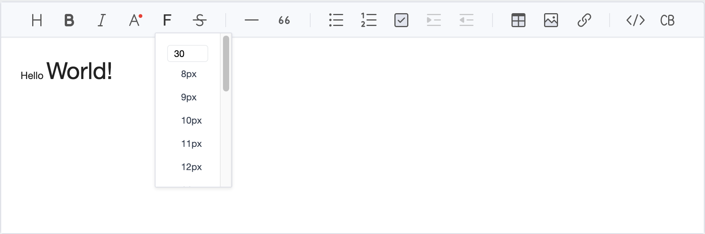

# tui-editor-plugin-reference

This is a plugin of [TOAST UI Editor](https://github.com/nhn/tui.editor/tree/master/apps/editor) to include references.<br>
based on [@paerck25/tui-editor-plugin-font-size](https://github.com/paerck25/tui-editor-plugin-font-size)



### Install

```sh
$ npm install tui-editor-plugin-reference

or

$ yarn add tui-editor-plugin-reference
```

### Usage

```js
import Editor from "@toast-ui/editor";
import fontSize from "tui-editor-plugin-reference";
import "tui-editor-plugin-font-size/dist/tui-editor-plugin-reference.css";

const editor = new Editor({
  // ...
  plugins: [reference],
});
```
